class: animated, fadeIn, middle
layout: true

```{r xaringan-themer, include=FALSE, warning=FALSE}
library(xaringanthemer)
style_solarized_light(
  text_font_google = google_font("Fira Sans", "300"),
  header_font_google = google_font("Fira Sans Condensed","600"),
  code_font_google = google_font("Fira Code")
)
```

```{r, load_refs, include=FALSE, cache=FALSE}
library(RefManageR)
BibOptions(check.entries = FALSE,
           bib.style = "authoryear",
           cite.style = "authoryear",
           style = "markdown",
           hyperlink = FALSE,
           dashed = FALSE)
myBib <- ReadBib("index.bib")
```

<style type="text/css">

/* .remark-slide-content h1 {
  font-size: 600%;
}
*/

.remark-slide-number {
  position: inherit;
}

.remark-slide-number .progress-bar-container {
  position: absolute;
  bottom: 0;
  height: 4px;
  display: block;
  left: 0;
  right: 0;
}

.remark-slide-number .progress-bar {
  height: 100%;
  background-color: red;
}
.scale-30 img { width: 30%; height: 30%; }
.scale-40 img { width: 40%; height: 40%; }
.scale-45 img { width: 45%; height: 45%; }
.scale-60 img { width: 60%; height: 60%; }
.scale-70 img { width: 70%; height: 70%; }
.scale-75 img { width: 75%; height: 75%; }
.scale-80 img { width: 80%; height: 80%; }
.scale-85 img { width: 85%; height: 85%; }
.scale-125 img { width: 125%; height: 125%; }
.big { font-size: 200%; }
.bigger { font-size: 400%; }
.biggest { font-size: 600%; }
.footer {
  position: absolute;
  bottom: 10px;
}
</style>

```{r setup, include=FALSE}
options(htmltools.dir.version = FALSE)
knitr::opts_chunk$set(
  fig.width=9, fig.height=3.5, fig.retina=3,
  out.width = "100%",
  cache = FALSE,
  echo = TRUE,
  message = FALSE, 
  warning = FALSE,
  hiline = TRUE
)
xaringanExtra::use_tile_view()
xaringanExtra::use_extra_styles(
  hover_code_line = TRUE,         #<<
  mute_unhighlighted_code = TRUE  #<<
)
```
---
class: title-slide

# Social Context and Historical Perspective

### identity and cultural norms; regulatory requirements and standards

### slideshow by Mick McQuaid

.footer[This is a slideshow. Use the arrow keys to navigate.]

---
class: animated, fadeIn

# Identity and Cultural Norms

---

.center[.scale-60[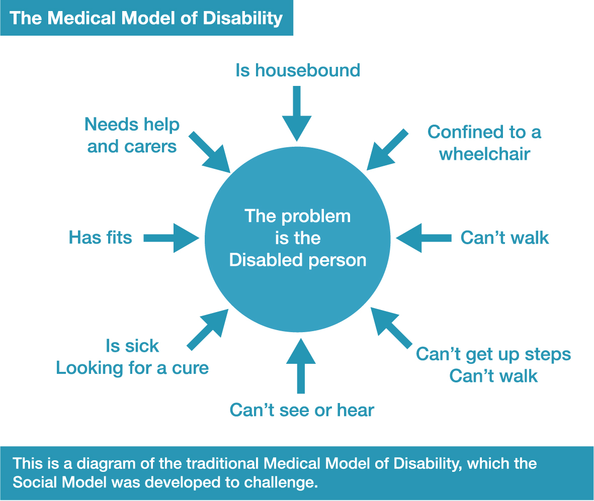]]

???

Source: [https://www.inclusionlondon.org.uk/wp-content/uploads/2015/05/social-model-graphic_expanded-02.jpg](https://www.inclusionlondon.org.uk/wp-content/uploads/2015/05/social-model-graphic_expanded-02.jpg)

---

.center[.scale-60[ 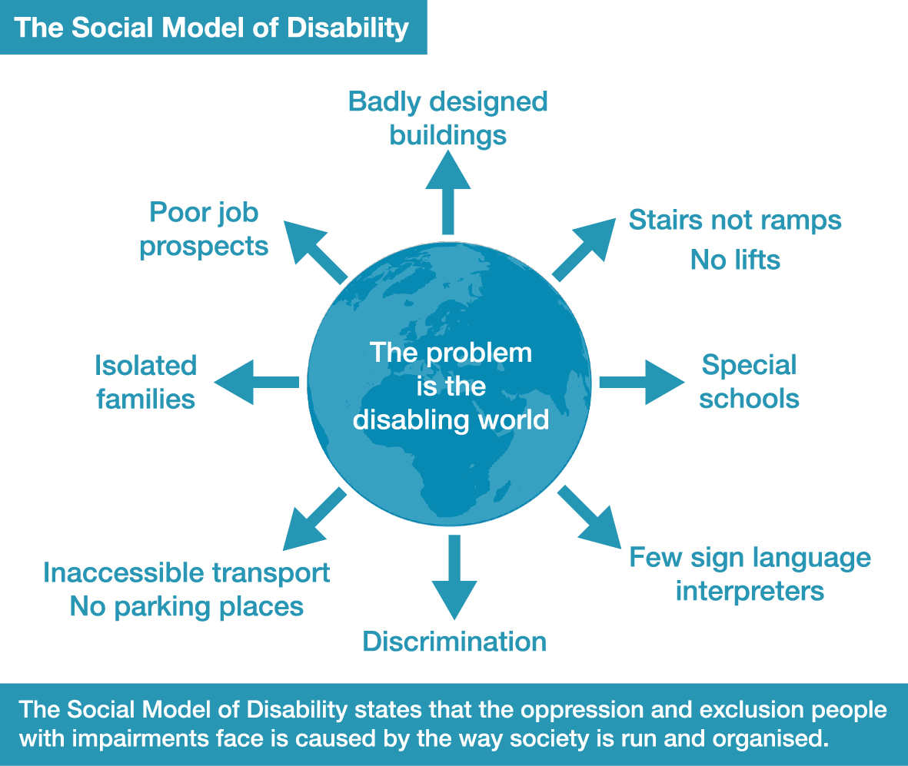]]

???


Source: [https://www.inclusionlondon.org.uk/wp-content/uploads/2015/05/social-model-graphic_expanded-01.jpg](https://www.inclusionlondon.org.uk/wp-content/uploads/2015/05/social-model-graphic_expanded-01.jpg)

---

.pull-left[
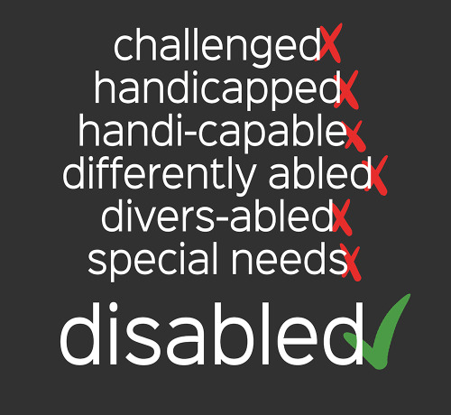
]

.pull-right[
## terminology

Thirty years ago, I was asked to make a logo for a group of lesbians who wanted to be called "Differently Pleasured" in response to some disabled activist women who called themselves "Differently Abled". Was it a joke? Were they trying to offend the others? I'll never know the point for certain but it raises an issue about speech and who gets to name themselves what.
]

---

# Establishment of Regulatory Requirements and Norms

---

.pull-left[
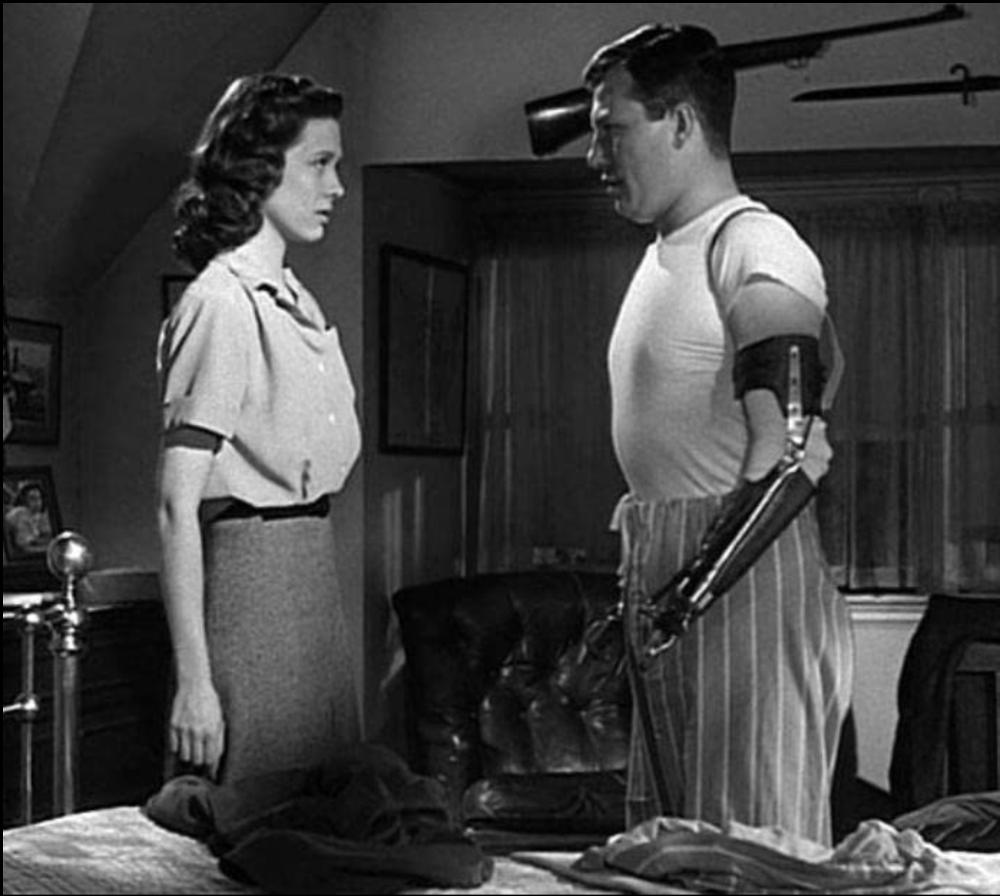
]

.pull-right[
## The role of WWII

Americans may have first awakened to their responsibilities for disabled people with the return of disabled veterans from WWII. Pictured here is one such veteran, Harold Russell, who starred in *The Best Years of Our Lives* (1946).
]

???

Harold Russell is pictured with Cathy O'Donnell in a still displayed at the IMDB. Russell portrayed a disabled serviceman struggling to reintegrate into American life in the celebrated war movie, *The Best Years of Our Lives* (1946).

---

.pull-left[
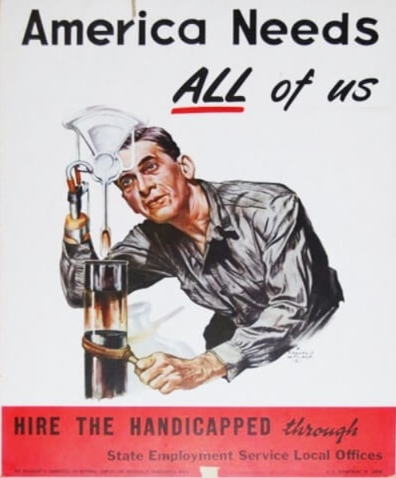
]

.pull-right[
### By 1947, President Truman established a committee to promote employment of the disabled
### Here is a 1951 poster from their annual campaign
]

???

This poster was circulated during "Employ the Handicapped" week in 1951. It was created by what is now called the President's Committee on Employment of People with Disabilities, formed by President Truman in 1947. The Smithsonian exhibits this poster, referring to the man's right hand as a "split-hook hand."

Source: [https://www.vocationaltraininghq.com/vocational-rehabilitation](/https://www.vocationaltraininghq.com/vocational-rehabilitation/)

---

.pull-left[
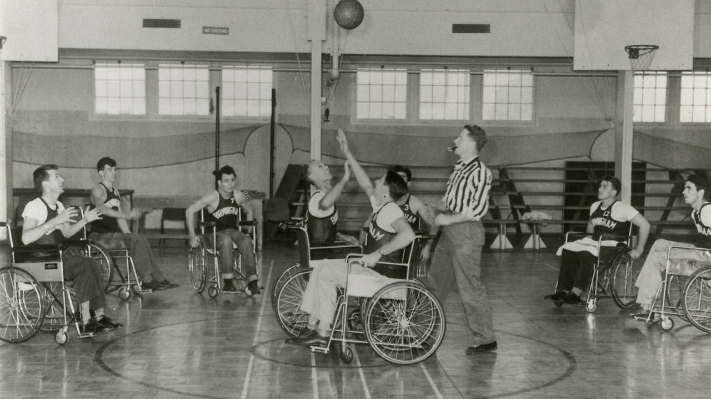
]

.pull-right[
An early wheelchair basketball game typifies activities once denied to persons with disabilities
]

???

Source: [https://img.tpt.cloud/nextavenue/uploads/2020/11/wheelchairbasketball.inside.1280x720.jpg](https://img.tpt.cloud/nextavenue/uploads/2020/11/wheelchairbasketball.inside.1280x720.jpg)

---

## Accessibility as a civil right

---

.pull-left[
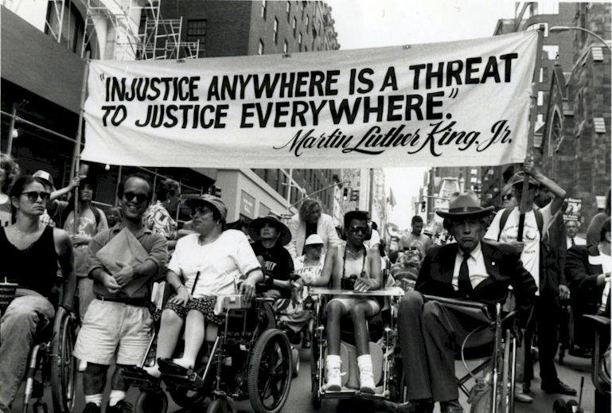
]

.pull-right[
### During the civil rights movement of the 1960s, disabled people began to organize
### In 1973, Section 504 of the Rehabilitation Act was passed
]

???

... to provide rights to persons with disabilities in HUD-funded programs and activities. HUD is the US Department of Housing and Urban Development.

Picture Source: [https://www.zinnedproject.org/wp-content/uploads/2015/11/march_for_disabilityinclusion.jp](ghttps://www.zinnedproject.org/wp-content/uploads/2015/11/march_for_disabilityinclusion.jpg)

---

.pull-left[
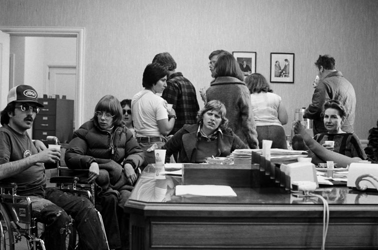
]

.pull-right[
Sit-ins were one civil disobedience strategy used to secure Section 504 rights.
]

???

Source: [https://www.foundsf.org/images/thumb/5/54/Dailylife_by_HoiLynn_D%27Lil.jpg/756px-Dailylife_by_HoiLynn_D%27Lil.jpg](https://www.foundsf.org/images/thumb/5/54/Dailylife_by_HoiLynn_D%27Lil.jpg/756px-Dailylife_by_HoiLynn_D%27Lil.jpg)

---

.pull-left[
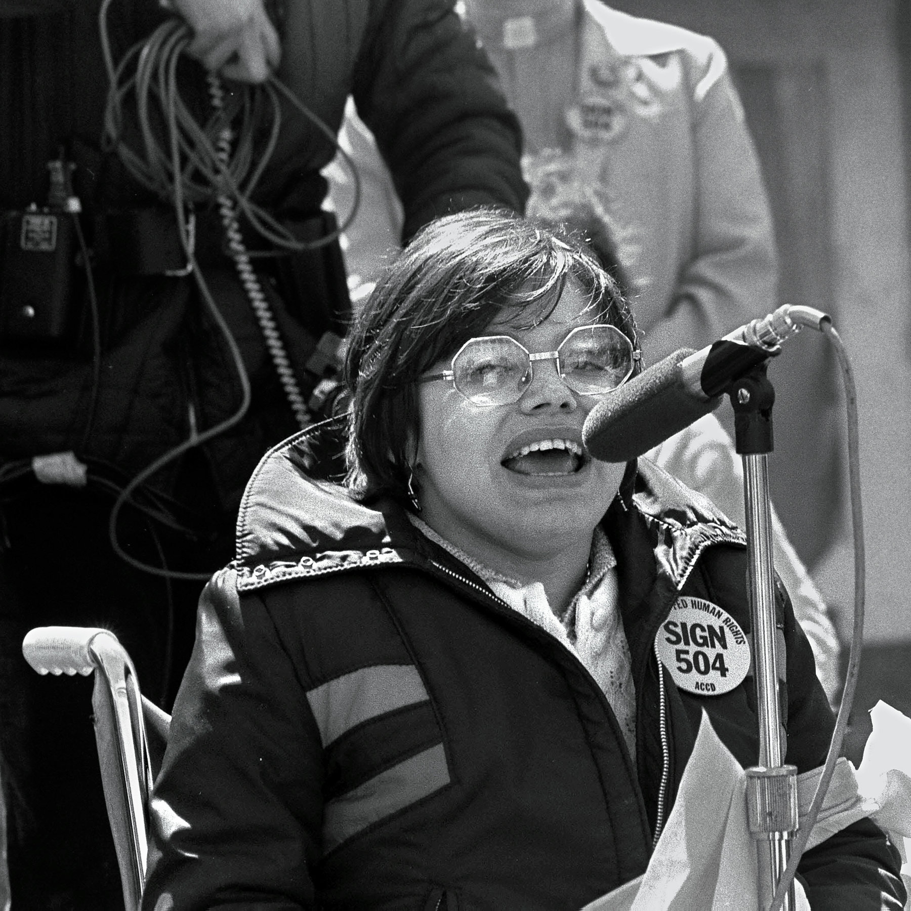
]

.pull-right[
Activist Judy Heumann speaking
]

???

Source: [https://static01.nyt.com/images/2020/03/26/arts/25cripcamp-qa1/25cripcamp-qa1-mediumSquareAt3X-v2.jpg](https://static01.nyt.com/images/2020/03/26/arts/25cripcamp-qa1/25cripcamp-qa1-mediumSquareAt3X-v2.jpg)

---

.center[.scale-70[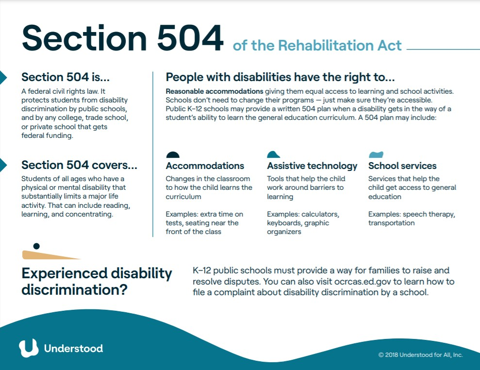]]

???

Source: [https://www.understood.org/articles/en/section-504-fact-sheet?utm_source=pinterest&utm_medium=social&utm_campaign=understoodorg](https://www.understood.org/articles/en/section-504-fact-sheet?utm_source=pinterest&utm_medium=social&utm_campaign=understoodorg)

---

.pull-left[

]

.pull-right[
Protesters crawling up the steps to the US Capitol
]

???

Source: [https://newmobility.com/wp-content/uploads/2021/06/Crawl_th-768x616.jpg](https://newmobility.com/wp-content/uploads/2021/06/Crawl_th-768x616.jpg)

---

.pull-left[
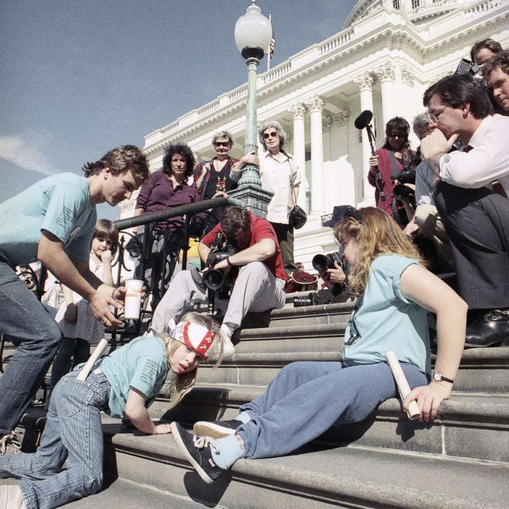
]

.pull-right[
Protesters crawling up the steps to the US Capitol
]

???

Source: [https://s.abcnews.com/images/Politics/disability-ap-er-200304_hpMain_2_1x1_992.jpg](https://s.abcnews.com/images/Politics/disability-ap-er-200304_hpMain_2_1x1_992.jpg)

---

ADA (The Americans with Disabilities Act) History and Basic Rules

---

.pull-left[
.scale-125[]
]

.pull-right[
The ADA logo
]

---

.center[.scale-125[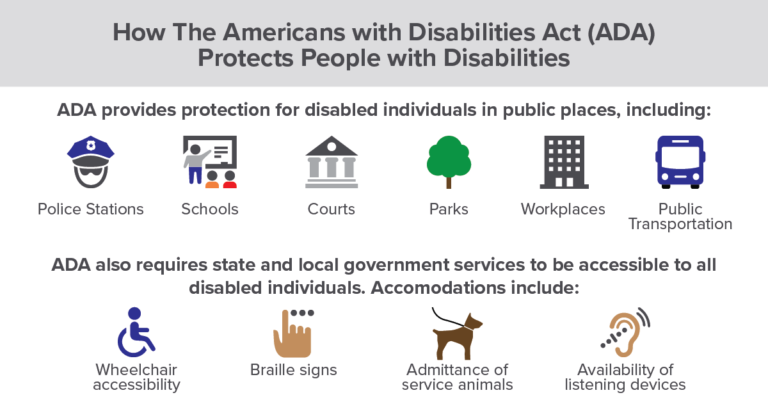]]

???

Source: [https://www.advocator.com/blog/the-americans-with-disabilities-act-turns-30/](https://www.advocator.com/blog/the-americans-with-disabilities-act-turns-30/)

---

.center[.scale-125[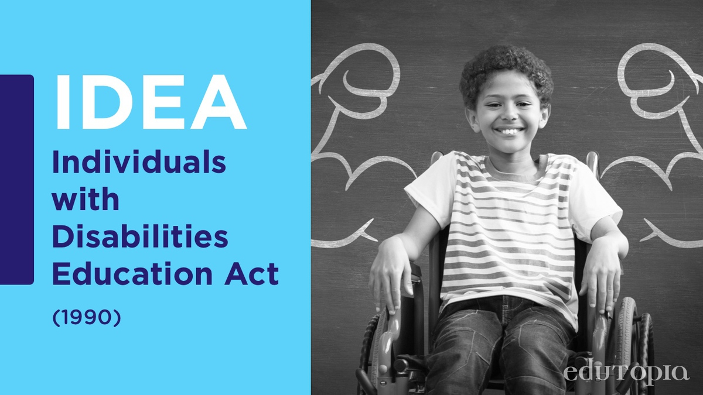]]

---

Not all frameworks are in law. For example, `r Citet(myBib, "Dogucu2021")` is a voluntary framework for accessibility in data science.

---

.biggest[END]

---

## references

```{r refs, echo=FALSE, results="asis"}
PrintBibliography(myBib)
```

---
class: middle

# Colophon

This slideshow was produced using an R package called *Xaringan*.

The theme is *Solarized Light*.

The fonts are Fira Sans (body), Fira Sans Condensed (headings), and Fira Code.

This slideshow is on GitHub in the `mickmcq/accessibilitySlides` repo.
